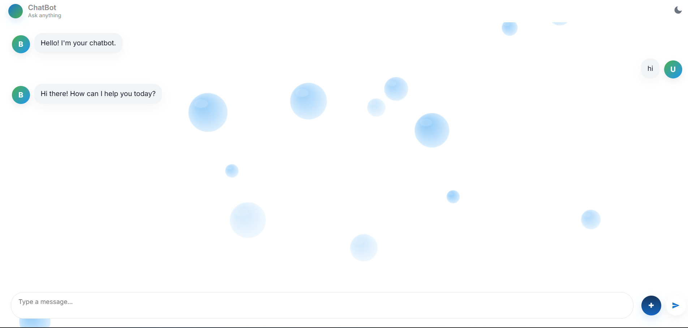
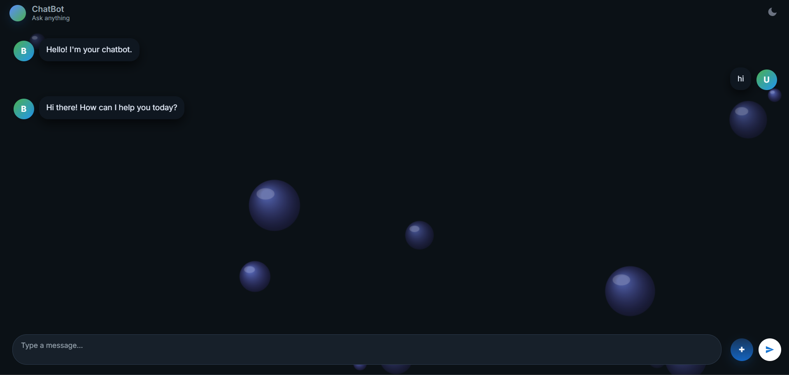

# AI_ChatBot
An interactive AI chatbot powered by the Gemini API with a bubble-blast background effect, theme changer, and file/image upload support. Designed to be fast, responsive, and engaging with a clean, modern UI.
# 💬 Interactive AI Chatbot — Powered by Gemini API  

---

## 🚀 Features  

-  **AI-Powered Conversations** using Gemini API  
-  **Bubble Blast Background Effect** for an appealing UI  
-  **Theme Changer** (Light/Dark modes)  
-  **File & Image Upload** with smooth handling  
-  **Media Previews** (images, files)  
-  **Responsive Design** for all devices  
-  **Accessible UI** (keyboard & screen-reader friendly)  
-  **Fast & Interactive** with clean animations  

---

## Preview  

### Light Theme  

  

  

### Dark Theme  

  

  
---

## 🛠️ Tech Stack  

---

